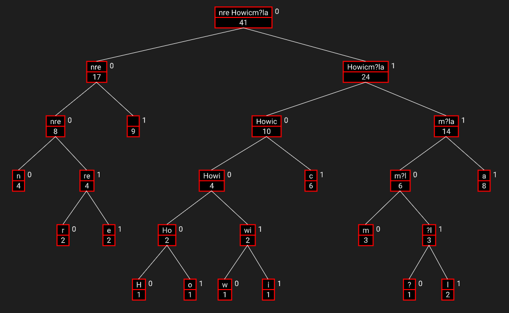

# Huffman Coding Visualization

A simple web based project to generate a huffman tree for any input string.

A local server is needed to run the code. (Use vscode live server to get started fast)

### Final Result

### Input
